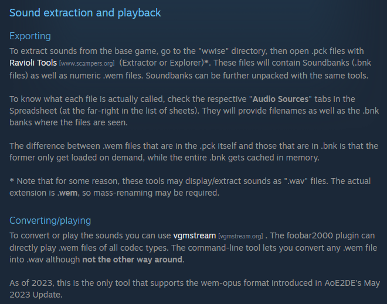
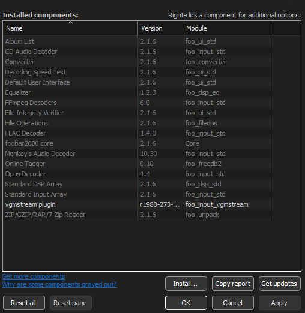
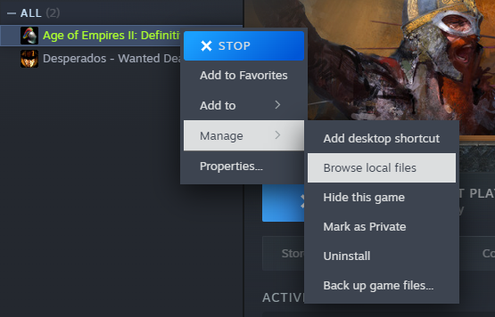
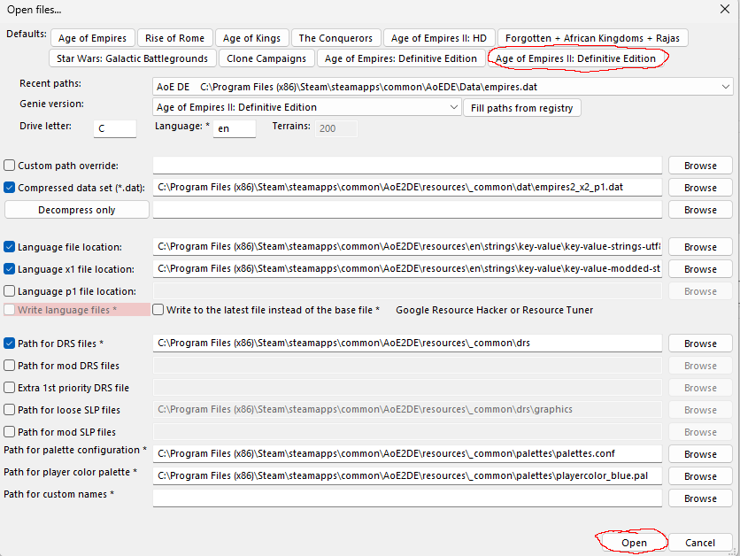
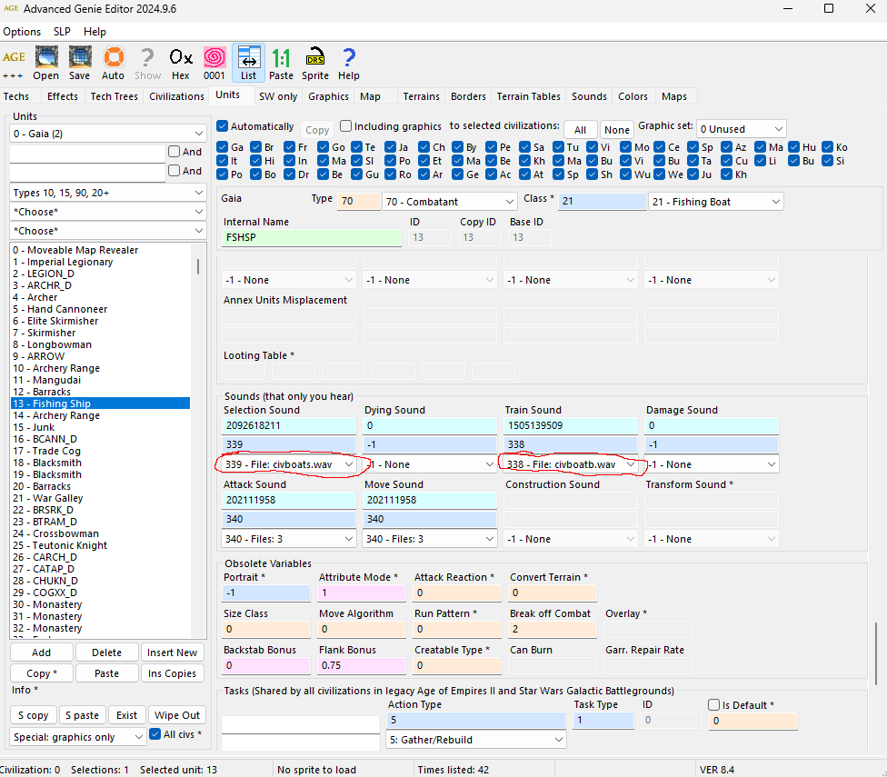
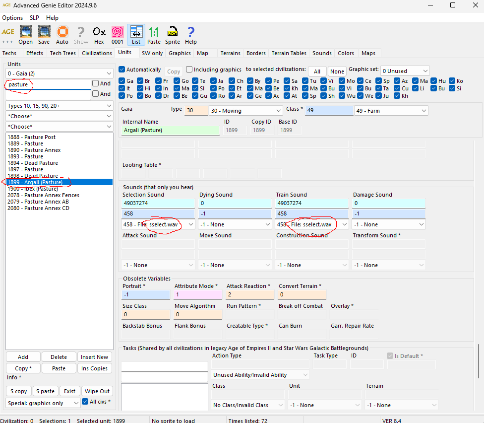

# aoe2de-modcollection

## 🎧 How to EQ In-Game Sound Effects (AOE2:DE)

---

### 🔍 Extracting `.wem` Files from the Game

If you can't get `.wem` files by subscribing to an existing mod, here's how:

- Locate the in-game sound files manually.
  
  

- Download **Ravioli Extractor**  
  [https://www.scampers.org/steve/sms/other.htm#ravioli_download](https://www.scampers.org/steve/sms/other.htm#ravioli_download)

- Use **foobar2000** + **vgmstream plugin** to preview and find the audio you want:  
  [https://vgmstream.org/](https://vgmstream.org/)

    
  

---

### 🔄 Convert `.wem` to `.wav` (for EQ in Audacity)

- Install **vgmstream command-line tool**

  

- Open the folder in a terminal:

    
  

- Copy the path of your `.wem` file

  

- Use the `-o sound.wav` option to name your output file

  

---

### 🔁 Convert `.wav` Back to `.wem` (for Use in a Mod)

- Install **Wwise Launcher**
- Create a free account (non-commercial use only)
- Skip all unnecessary plugins during install
- Create a new Wwise project
- Set **Source Encoding** to `"Vorbis High Quality"`

    
    
  

- Import your `.wav` files

    
  

- Export the files as `.wem`

  
### 🔁 Finding the correct Identifier for the  `.wem` (for Use in a Mod)

- The sound effect you are looking for might be in StepS's Spreadsheet
- https://docs.google.com/spreadsheets/d/1bczdFQksnbLnjI5zAkw-mSpb9MnnxxEkHDiz1PftIHw/edit

- If you can't find it there you might be able to find it with the AdvancedGenieEditor
- Open the game folder

 

- Open Tools-Builds/AdvancedGenieEditor.exe
- Select "Age of Empires II: Definitive Edition" and hit "Open"

 

- Find the ingame unit and then scroll down until you reach the section on sound effects.

 
  
