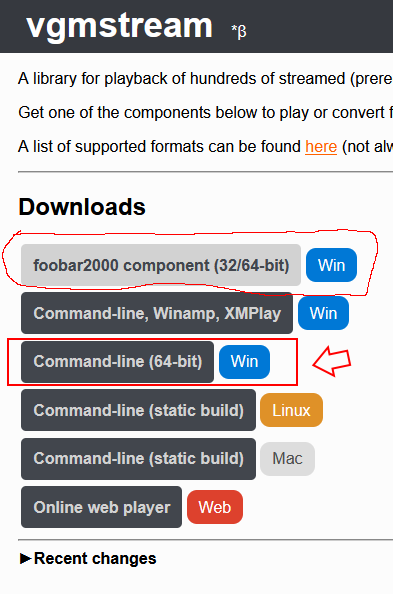
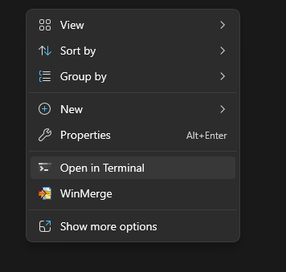
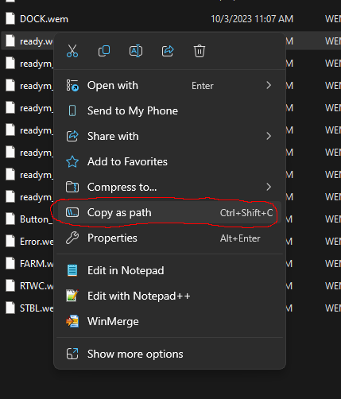
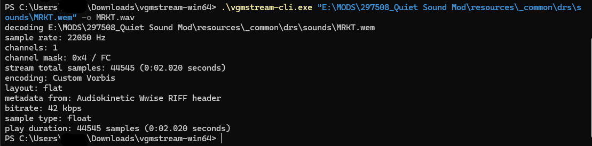
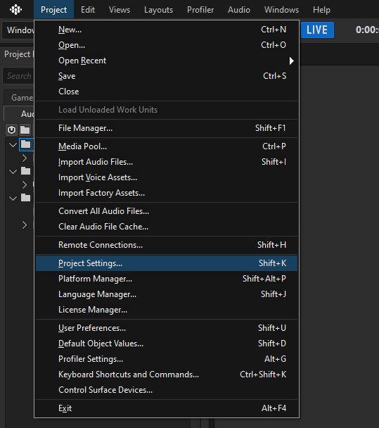
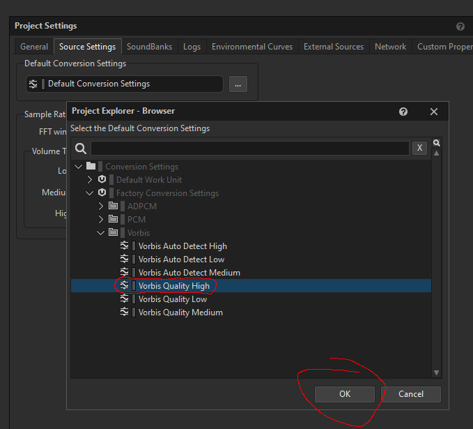
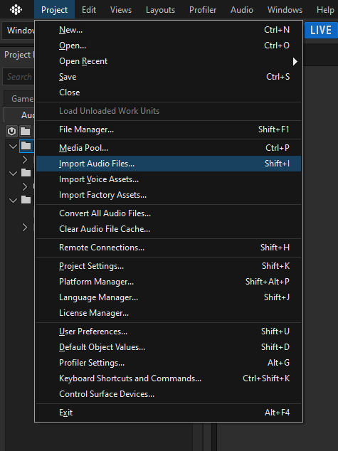
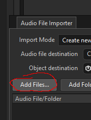
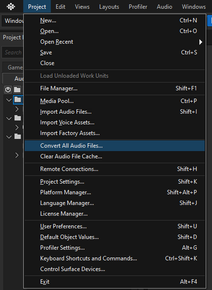

# aoe2de-modcollection

How to convert a .wem file to a .wav file so you can eq it with audacity

1. Install vgmstream command line tool
2. 
3. open the extracted vgmstream folder in a terminal
4. 
5. 
6. Copy your .wem file as a path
7. 
8. "-o sound.wav" lets you specify the new name
9. 

How to convert a .wav file to a .wem file to use as a mod

1. Install WWise Launcher
2. Have to make an account, and you are not allowed to use it commercially
3. You dont need any of the plugins that are auto selected for the installation process
4. Make a new Project
5. Set the Source Encoding to "Vorbis High Quality"
6. 
7. 
8. 
9. Upload your files (has to be .wav)
10. 
11. 
12. Export them as .wem
13. 
